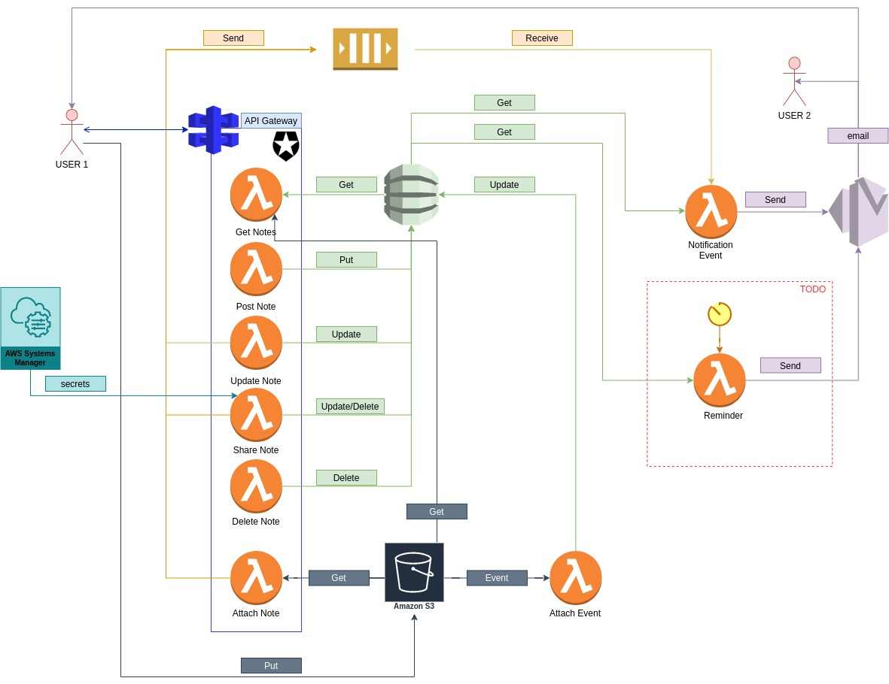
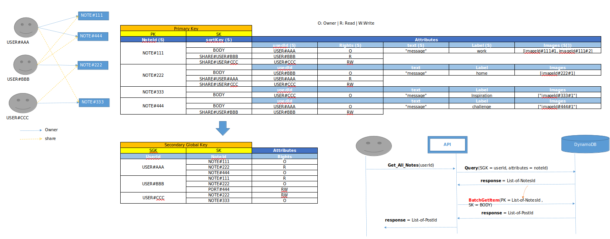
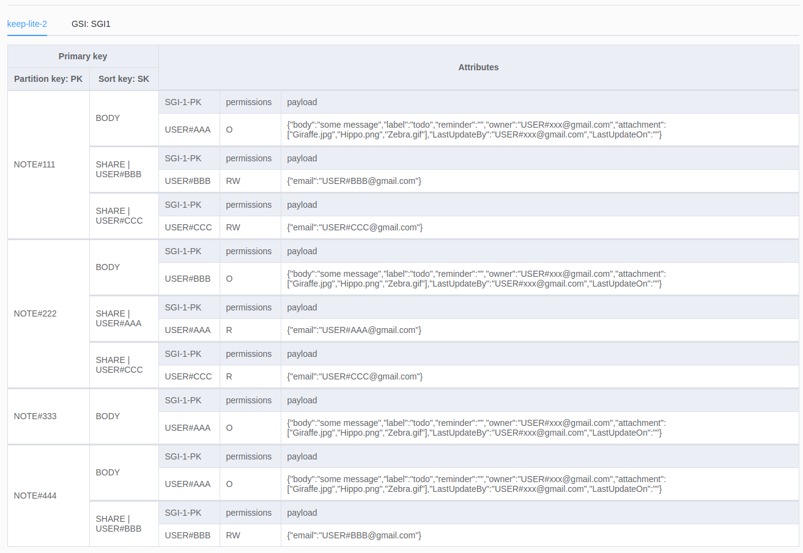
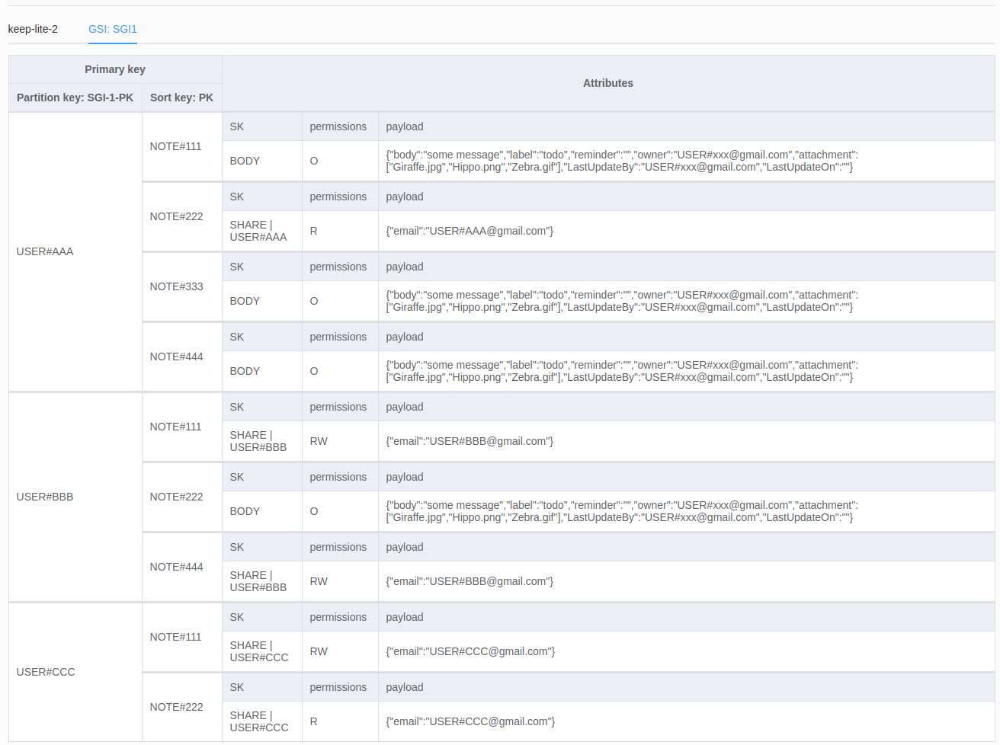

# Note-Lite-App

Note Lite App is a small serverless application implemented over Amazon Web Services (AWS) that emulates the [Keep App](https://keep.google.com/) by Google.

# Features
- Post a note
- Get notes
- Update Note
- Share a note with other user using email and permissions:
    - Permissions: (R) Read or (RW) Read/Write.
    - Only the creator of the note can share the note.
    - A note can only be shared with a registered user (logged-in at least on into the app).
- Add attachments to a note (more than one attachment).
- Keep the history of last modification: user and time.
- Receive an email each time a note is modified by other user.
- Receive an email each time a note is shared with you (TODO).
- Program a reminder and receive an email (TODO).

# Application

The project is divided in 2 parts:
- Client: This a simple client took from the [Auth0 repository](https://github.com/auth0-samples/auth0-nodejs-webapp-sample/) in Github and modified to display the JWT token once the user is logged in.

- Backend: The serverless application.

# Running the app

## Client
Go to the *Client* directory, install the dependencies and run the project.
```bash
cd client
npm install
npm run start
```
Use the user interface for logged-in into [Auth0](https://auth0.com/) (only the email will be requested from your google account). If the log-in is successful, a summary of the user information will be displayed. Keep this information as it will be use later for configure the Postman collection.

## Backend

### Online
The application is already set-up in AWS and not further actions need to be done.
In case you want to deploy your own instance of the application:go to the *backend* directory, install the dependencies and run the project.
```bash
cd backend
npm install
npm run deploy
```
Note: The application is using *"SSM"* for storing the secrets of *Auth0*. Check the file [example.env](./backend/example.env) for get a list of variables that needs to be set manually using the AWS Console in [SSM](https://docs.aws.amazon.com/systems-manager/latest/userguide/what-is-systems-manager.html)/Parameters store.
### Offline
The application supports a complete serverless offline simulation. To run  the application offline: go to the *backend* directory, install the dependencies and run the project.
```bash
cd backend
npm install
npm run sqs_start
npm run offline
```
Note: 
- When working offline, the SSM-offline-plugin is taken the secretes save in the file *".env"*. Change the values in the file [example.env](./backend/example.env) and rename the file to *.env*.
- The command *npm run sqs_start* needs to be execute only once even if the serverless application is stopped and restart.

# Auth0
The application is using [Auth0](https://auth0.com/) for the authorization to access the Note-Lite APIs. The application is using 2 different kind of Auth0 app:
- **Single page application**: used by the client and backend APIs authorization.
- **Machine to Machine application**: used by the backend to retrieve information about the login users (for instance when sharing a Note, the back end will check in the database if target user is registered).

# Testing the app

The project can be test using the [Postman](https://www.postman.com/) collection in side the project: [backend/Note-Lite-App.postman_collection.json](./backend/Note-Lite-App.postman_collection.json).

Once the collection is imported to Postman:

## Online
Set up the env. variables as follow:
- **host**: https://dsgx3zus21.execute-api.eu-central-1.amazonaws.com/dev 
- **toke**: the JWT retrieve using the client application. Note:  the JWT is shown as "id_token" in the client application once the log-in is successful.   

## Offline
Set up the env. variables as follow:
- **host**: http://localhost:3000
- **toke**: same as above.  

# Email notification

Unfortunately, in order to be able to send emails to not verified email address using AWS-SES, the sandbox needs to be "move out" as explained [here](https://docs.aws.amazon.com/ses/latest/DeveloperGuide/request-production-access.html).
<br> For testing the application and receive email notifications, you need to verify the emails as explained [here](https://docs.aws.amazon.com/ses/latest/DeveloperGuide/verify-email-addresses.html).<br>
 However, once the email is verified, your application can send emails from this address. Therefore, for testing this feature is better to create 2/3 dummy users and verified the emails  addresses (do not use your personal email as it will grant rights to the application as explained above).<br>

# Serverless cloud architecture

The following diagram shows the serverless architecture of the application and highlight all the AWS services used and the relations between them. 



# DynamoDB Data-model

The first approach for modeling the DynamoDB data was using MS-excel and you can find the first draft in [DynamoDB](doc/DynamoDB.xlsx). <br>

However for modelling DynamoDB data, AWS has a tool that can found [here](https://docs.aws.amazon.com/amazondynamodb/latest/developerguide/workbench.html). The final data models for the app were done using this tool and the files can be found in [DynamoDBDataModels](backend/DynamoDBDataModels). 

## DynamoDB table
 

## Sendary Global Index


# Others 
## Author

[edgarcgarzon](https://github.com/edgarcgarzon)

## License

This project is licensed under the MIT license. See the [LICENSE](LICENSE) file for more info.
